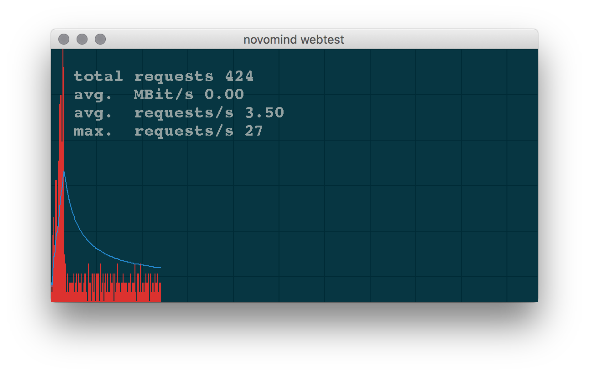

## Webtest
A load test tool designed to test java based web applications.
[](https://travis-ci.org/novomind-ishop/webtest)


### Build / Usage
```
mvn clean package
java -jar target/webtest.jar --help
```

### Help
Webtest benchmarks the performance of a webservice, by requesting URLs and measuring the time of each request.
When all request are finished/have answered, a small statistic is presented.

Usage:
```
 java -jar webtest.jar users runtime delay [OPTION...] URL...

 users     The number of users/clients that simultaneously request the URLs.
 runtime   The duration of this test in minutes.
 delay     Delay between two requests of the same user. If 0, then URLs are requested as fast as possible (dangerous!)
 URL...    One or more URLs that should be requested. See URLs section.

Options:
 -u user   The username, that will be used for basic authentication.
 -p pass   The password, that will be used for basic authentication.
 --gui     Show graphic output.
 -f file   The file from which URLs get loaded. One url per line. -s option is allowed in each line beginning.
 -v        Verbose output.

URLs: [-s] URL[POST[POST-BODY]]
 -s        This URL will be requested only once, but for each user (i.e. add to basket, login etc)
 --csrf     This URL will be requested only once per user to retrieve the CSRF token that the page at this url holds.
 URL       URLs are expected in the general http://site/file.html?page=123 way.
           Also https is supported, even though the certificate is not validated!
 POST      Add POST at the end of the URL and all data after POST will be posted.
```
#### Output
 The output are pairs of two numbers, where the first number is an answer time in milliseconds and the second number, how often this time was achieved.
 In between are certain separating lines, like ---percentile---, for simple statistic reasons.


#### Examples
```java -jar webtest.jar 5 1 1 http://www.novomind.com/```

Five users request the site http://www.novomind.com/ for 1 minute with a 1 second delay between each request.

```java -jar webtest.jar 25 3 0 http://www.novomind.com/hiddenarea/ https://www.google.com/ -u fritz -p geheim```

25 users request the site http://www.novomind.com/hiddenarea/ and https://www.google.com/ for 3 minutes with a 0 second delay (creates a lot of requests!). For all (both) sites the user 'fritz' and password 'geheim' is used as authentication.

```java -jar webtest.jar 1 1 10 http://www.shop.com/ -s https://www.shop.com/add/product/POSTitemId=dummyId```

 1 user requests for one minute with a request delay of 10 seconds the site www.shop.com over and over. The second url is requested only once (-s) and has additional POST information.

```java -jar webtest.jar 1 1 10 https://www.shop.com/add/product/POSTitemId=dummyId --csrf https://www.shop.com/home```

 1 user requests for one minute with a request delay of 10 seconds and sends POST requests to the url https://www.shop.com/add/product/ over and over. The second url is requested only once to retrieve the csrf token for each user (--csrf).